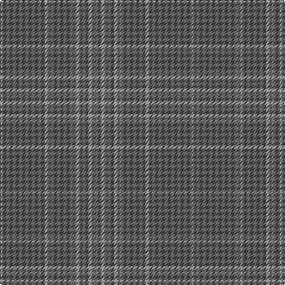

The parent of this is [Hebridean Mist Fashion Tartan Tartan Number: 6823. Earliest known date: 2005 For a new House of Edgar Collection in wedding gray. This is the same sett and colours as 6822 but as in Dark Island, the sett has been highlighted in the weaving process by with parts of the patern being woven 'face up' and the remainder 'back up'. To further accentuate the sett, the weft is slightly darker than the warp. Theoretically only one of these setts should be included but we have stretched a point to provide dated documentation for the weaver. See products available Copyright © Blair Urquhart, Comrie, 2015](/tartans/n/2/na36/n4/na20/n6/na6/n6/na/4/)

This was sourced from house-of-tartan.  It is a [8 stripes tartan](/stripes/stripes8/).

Original link http://www.house-of-tartan.scotland.net/house/TartanViewjs.asp?colr=Def&tnam=6823

## Thread count
N/2 Na36 N4 Na20 N6 Na6 N6 Na/4

## Palette
Each colour and its ΔE from the base-6 reference it is a variant of.

| Colour | Shade | Base | ΔE (OKLab) |
|---|---|---|---|
| N |  `#888888` | R  | 0.24 |
| Na |  `#5C5C5C` | B  | 0.14 |

# Sample pattern

ID: /variants/n/2/na36/n4/na20/n6/na6/n6/na/4-n888888-na5c5c5c/
