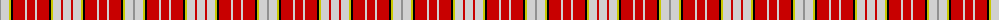

The parent of this is [Ogilvy D](/tartans/n/2/na8/y2/k2/r12/na2/r8/na2/r12/k2/y2/na8/r2/na/8/)

This was sourced from weddslist.  It is a [14 stripes tartan](/stripes/stripes14/).

Original link http://www.weddslist.com/cgi-bin/tartans/pg.pl?source=rb

## Thread count
N/2 Na8 Y2 K2 R12 Na2 R8 Na2 R12 K2 Y2 Na8 R2 Na/8

## Palette
Each colour and its ΔE from the base-6 reference it is a variant of.

| Colour | Shade | Base | ΔE (OKLab) |
|---|---|---|---|
| K |  `#000000` | K  | 0.00 |
| N |  `#909090` | Y  | 0.24 |
| Na |  `#D0D0D0` | W  | 0.11 |
| R |  `#C80000` | R  | 0.00 |
| Y |  `#C8C800` | Y  | 0.05 |

ID: /variants/n/2/na8/y2/k2/r12/na2/r8/na2/r12/k2/y2/na8/r2/na/8-k000000-n909090-nad0d0d0-rc80000-yc8c800/
