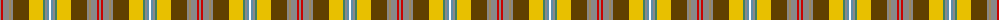

The parent of this is [Porcupine (Fashion)](/tartans/n/2/r2/n6/lt2/n2/t16/y14/g2/n2/b2/w/2/)

This was sourced from tartans-authority.  It is a [11 stripes tartan](/stripes/stripes11/).

Original link http://www.tartansauthority.com/tartan-ferret/display/1303/

## Thread count
N/2 R2 N6 LT2 N2 T16 Y14 G2 N2 B2 W/2

## Palette
Each colour and its ΔE from the base-6 reference it is a variant of.

| Colour | Shade | Base | ΔE (OKLab) |
|---|---|---|---|
| B |  `#5C8CA8` | B  | 0.23 |
| G |  `#408060` | G  | 0.13 |
| LT |  `#A08858` | Y  | 0.21 |
| N |  `#888888` | R  | 0.24 |
| R |  `#C80000` | R  | 0.00 |
| T |  `#604000` | G  | 0.14 |
| W |  `#FCFCFC` | W  | 0.03 |
| Y |  `#E8C000` | Y  | 0.00 |

ID: /variants/n/2/r2/n6/lt2/n2/t16/y14/g2/n2/b2/w/2-b5c8ca8-g408060-lta08858-n888888-rc80000-t604000-wfcfcfc-ye8c000/
