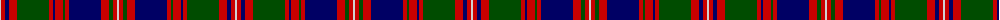

The parent of this is [MacIntyre](/tartans/n/2/r4/db4/r8/g32/r4/db2/r8/g2/r4/db32/r8/g4/r4/n/2/)

This was sourced from weddslist.  It is a [15 stripes tartan](/stripes/stripes15/).

Original link http://www.weddslist.com/cgi-bin/tartans/pg.pl?source=rb

## Thread count
N/2 R4 DB4 R8 G32 R4 DB2 R8 G2 R4 DB32 R8 G4 R4 N/2

## Palette
Each colour and its ΔE from the base-6 reference it is a variant of.

| Colour | Shade | Base | ΔE (OKLab) |
|---|---|---|---|
| DB |  `#000064` | B  | 0.17 |
| G |  `#004C00` | G  | 0.08 |
| N |  `#D0D0D0` | W  | 0.11 |
| R |  `#C80000` | R  | 0.00 |

ID: /variants/n/2/r4/db4/r8/g32/r4/db2/r8/g2/r4/db32/r8/g4/r4/n/2-db000064-g004c00-nd0d0d0-rc80000/
