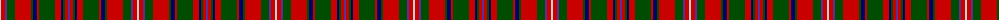

The parent of this is [MacKinnon](/tartans/n/2/r4/p2/g8/r16/g2/db4/r2/g16/r6/db2/g2/r3/p/2/)

This was sourced from weddslist.  It is a [14 stripes tartan](/stripes/stripes14/).

Original link http://www.weddslist.com/cgi-bin/tartans/pg.pl?source=rb

## Thread count
N/2 R4 P2 G8 R16 G2 DB4 R2 G16 R6 DB2 G2 R3 P/2

## Palette
Each colour and its ΔE from the base-6 reference it is a variant of.

| Colour | Shade | Base | ΔE (OKLab) |
|---|---|---|---|
| DB |  `#000064` | B  | 0.17 |
| G |  `#004C00` | G  | 0.08 |
| N |  `#D0D0D0` | W  | 0.11 |
| P |  `#5A3094` | B  | 0.08 |
| R |  `#C80000` | R  | 0.00 |

ID: /variants/n/2/r4/p2/g8/r16/g2/db4/r2/g16/r6/db2/g2/r3/p/2-db000064-g004c00-nd0d0d0-p5a3094-rc80000/
