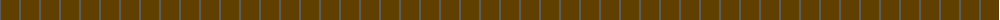
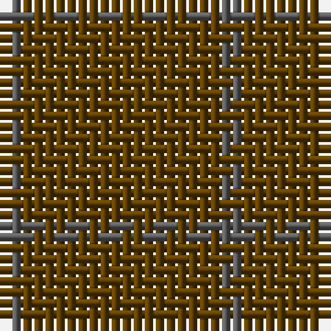

The parent of this is [Outlander #4](/tartans/n/2/t/18/)

This was sourced from tartans-authority.  It is a [2 stripes tartan](/stripes/stripes2/).

Original link http://www.tartansauthority.com/tartan-ferret/display/11116/

## Thread count
N/2 T/18

## Palette
Each colour and its ΔE from the base-6 reference it is a variant of.

| Colour | Shade | Base | ΔE (OKLab) |
|---|---|---|---|
| N |  `#5C5C5C` | B  | 0.14 |
| T |  `#604000` | G  | 0.14 |

# Sample pattern

ID: /variants/n/2/t/18-n5c5c5c-t604000/
