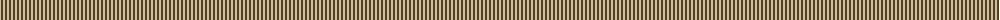
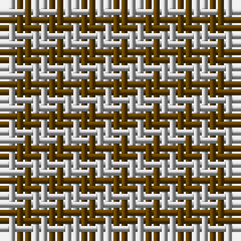

The parent of this is [Shepherd Brown & White (Fashion?)](/tartans/n/2/t/2/)

This was sourced from tartans-authority.  It is a [2 stripes tartan](/stripes/stripes2/).

Original link http://www.tartansauthority.com/tartan-ferret/display/3205/

## Thread count
N/2 T/2

## Palette
Each colour and its ΔE from the base-6 reference it is a variant of.

| Colour | Shade | Base | ΔE (OKLab) |
|---|---|---|---|
| N |  `#C0C0C0` | W  | 0.16 |
| T |  `#604000` | G  | 0.14 |

# Sample pattern

ID: /variants/n/2/t/2-nc0c0c0-t604000/
