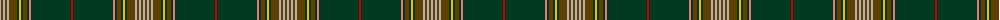

The parent of this is [Forster (Personal)](/tartans/n/2/t2/n2/t2/n2/t8/dg2/y2/dg2/t4/dg2/lr2/dg40/r/2/)

This was sourced from tartans-authority.  It is a [14 stripes tartan](/stripes/stripes14/).

Original link http://www.tartansauthority.com/tartan-ferret/display/8506/

## Thread count
N/2 T2 N2 T2 N2 T8 DG2 Y2 DG2 T4 DG2 LR2 DG40 R/2

## Palette
Each colour and its ΔE from the base-6 reference it is a variant of.

| Colour | Shade | Base | ΔE (OKLab) |
|---|---|---|---|
| DG |  `#003820` | G  | 0.16 |
| LR |  `#E87878` | R  | 0.19 |
| N |  `#B0B0B0` | Y  | 0.18 |
| R |  `#C80000` | R  | 0.00 |
| T |  `#604000` | G  | 0.14 |
| Y |  `#E8C000` | Y  | 0.00 |

ID: /variants/n/2/t2/n2/t2/n2/t8/dg2/y2/dg2/t4/dg2/lr2/dg40/r/2-dg003820-lre87878-nb0b0b0-rc80000-t604000-ye8c000/
