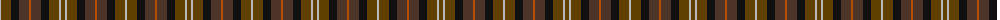

The parent of this is [Huntly #3](/tartans/n/2/ta10/k8/t10/do2/t10/k8/ta10/n2/ta/4/)

This was sourced from register-of-tartans.  It is a [10 stripes tartan](/stripes/stripes10/).

Original link https://www.tartanregister.gov.uk/tartanDetails.aspx?ref=1797

## Thread count
N/2 Ta10 K8 T10 DO2 T10 K8 Ta10 N2 Ta/4

## Palette
Each colour and its ΔE from the base-6 reference it is a variant of.

| Colour | Shade | Base | ΔE (OKLab) |
|---|---|---|---|
| DO |  `#B84C00` | R  | 0.08 |
| DR |  `#441800` | B  | 0.22 |
| K |  `#101010` | K  | 0.17 |
| N |  `#B8B8B8` | Y  | 0.17 |
| T |  `#4C3428` | B  | 0.16 |
| Ta |  `#604000` | G  | 0.14 |

ID: /variants/n/2/ta10/k8/t10/do2/t10/k8/ta10/n2/ta/4-dob84c00-dr441800-k101010-nb8b8b8-t4c3428-ta604000/
