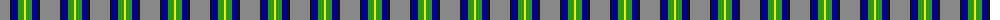
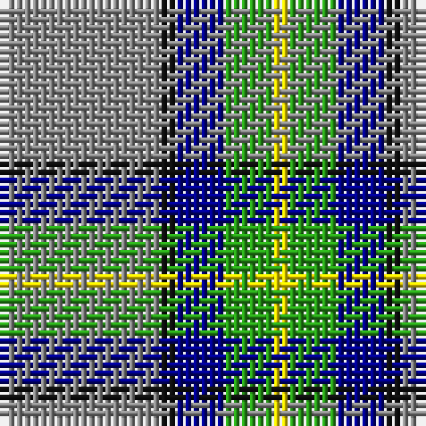

The parent of this is [Celtic Norse Heritage Society](/tartans/n/20/k2/db6/g6/y/2/)

This was sourced from register-of-tartans.  It is a [5 stripes tartan](/stripes/stripes5/).

Original link https://www.tartanregister.gov.uk/tartanDetails.aspx?ref=11093

## Thread count
N/20 K2 DB6 G6 Y/2

## Palette
Each colour and its ΔE from the base-6 reference it is a variant of.

| Colour | Shade | Base | ΔE (OKLab) |
|---|---|---|---|
| DB |  `#00008C` | B  | 0.13 |
| G |  `#289C18` | G  | 0.18 |
| K |  `#101010` | K  | 0.17 |
| N |  `#888888` | R  | 0.24 |
| Y |  `#FFE600` | Y  | 0.10 |

# Sample pattern

ID: /variants/n/20/k2/db6/g6/y/2-db00008c-g289c18-k101010-n888888-yffe600/
