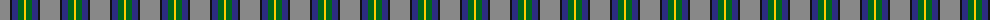
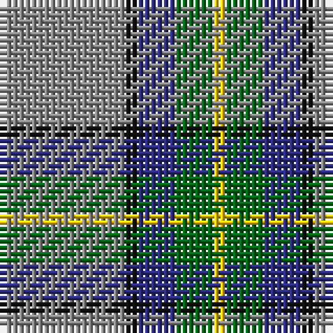

The parent of this is [Celtic Norse Heritage Society](/tartans/n/20/k2/db6/g6/y/2/)

This was sourced from tartans-authority.  It is a [5 stripes tartan](/stripes/stripes5/).

Original link http://www.tartansauthority.com/tartan-ferret/display/11093/

## Thread count
N/20 K2 DB6 G6 Y/2

## Palette
Each colour and its ΔE from the base-6 reference it is a variant of.

| Colour | Shade | Base | ΔE (OKLab) |
|---|---|---|---|
| DB |  `#2C2C80` | B  | 0.05 |
| G |  `#006818` | G  | 0.02 |
| K |  `#101010` | K  | 0.17 |
| N |  `#888888` | R  | 0.24 |
| Y |  `#FCCC00` | Y  | 0.04 |

# Sample pattern

ID: /variants/n/20/k2/db6/g6/y/2-db2c2c80-g006818-k101010-n888888-yfccc00/
