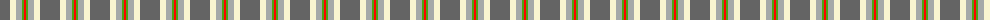
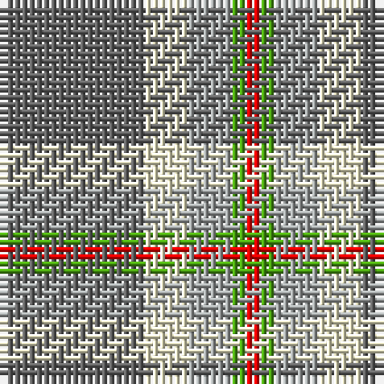

The parent of this is [Bagpipe Shop (Switzerland)](/tartans/n/20/ly6/na6/g2/r/2/)

This was sourced from register-of-tartans.  It is a [5 stripes tartan](/stripes/stripes5/).

Original link https://www.tartanregister.gov.uk/tartanDetails.aspx?ref=10773

## Thread count
N/20 LY6 Na6 G2 R/2

## Palette
Each colour and its ΔE from the base-6 reference it is a variant of.

| Colour | Shade | Base | ΔE (OKLab) |
|---|---|---|---|
| G |  `#4CA412` | G  | 0.21 |
| LY |  `#F8F4D0` | W  | 0.04 |
| N |  `#646464` | B  | 0.16 |
| Na |  `#A4A8A8` | Y  | 0.19 |
| R |  `#FF0000` | R  | 0.11 |

# Sample pattern

ID: /variants/n/20/ly6/na6/g2/r/2-g4ca412-lyf8f4d0-n646464-naa4a8a8-rff0000/
