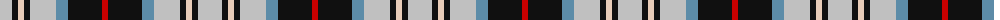

The parent of this is [Mitsukoshi (Corporate)](/tartans/n/24/k6/lr6/k6/n26/b12/k34/r/6/)

This was sourced from tartans-authority.  It is a [8 stripes tartan](/stripes/stripes8/).

Original link http://www.tartansauthority.com/tartan-ferret/display/2991/

## Thread count
N/24 K6 LR6 K6 N26 B12 K34 R/6

## Palette
Each colour and its ΔE from the base-6 reference it is a variant of.

| Colour | Shade | Base | ΔE (OKLab) |
|---|---|---|---|
| B |  `#5C8CA8` | B  | 0.23 |
| K |  `#101010` | K  | 0.17 |
| LR |  `#E8CCB8` | W  | 0.11 |
| N |  `#C0C0C0` | W  | 0.16 |
| R |  `#C80000` | R  | 0.00 |

# Sample pattern

ID: /variants/n/24/k6/lr6/k6/n26/b12/k34/r/6-b5c8ca8-k101010-lre8ccb8-nc0c0c0-rc80000/
