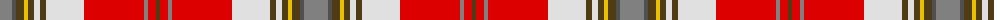

The parent of this is [MacLean of Duart Dress #3](/tartans/n/24/na4/t8/y4/t6/ln6/t6/ln38/r60/n4/r8/t/4/)

This was sourced from register-of-tartans.  It is a [12 stripes tartan](/stripes/stripes12/).

Original link https://www.tartanregister.gov.uk/tartanDetails.aspx?ref=2614

## Thread count
N/24 Na4 T8 Y4 T6 LN6 T6 LN38 R60 N4 R8 T/4

## Palette
Each colour and its ΔE from the base-6 reference it is a variant of.

| Colour | Shade | Base | ΔE (OKLab) |
|---|---|---|---|
| LN |  `#E0E0E0` | W  | 0.06 |
| N |  `#808080` | G  | 0.22 |
| Na |  `#505050` | B  | 0.12 |
| R |  `#DC0000` | R  | 0.04 |
| T |  `#503C14` | G  | 0.15 |
| Y |  `#E8C000` | Y  | 0.00 |

ID: /variants/n/24/na4/t8/y4/t6/ln6/t6/ln38/r60/n4/r8/t/4-lne0e0e0-n808080-na505050-rdc0000-t503c14-ye8c000/
