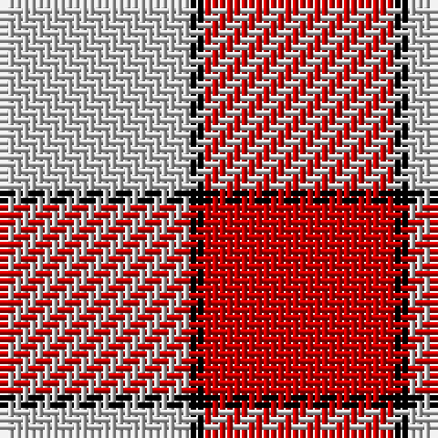

The parent of this is [Hose (Dunmore)](/tartans/n/26/k2/r/26/)

This was sourced from register-of-tartans.  It is a [3 stripes tartan](/stripes/stripes3/).

Original link https://www.tartanregister.gov.uk/tartanDetails.aspx?ref=1769

## Thread count
N/26 K2 R/26

## Palette
Each colour and its ΔE from the base-6 reference it is a variant of.

| Colour | Shade | Base | ΔE (OKLab) |
|---|---|---|---|
| K |  `#000000` | K  | 0.00 |
| N |  `#C8C8C8` | W  | 0.13 |
| R |  `#C80000` | R  | 0.00 |

# Sample pattern

ID: /variants/n/26/k2/r/26-k000000-nc8c8c8-rc80000/
