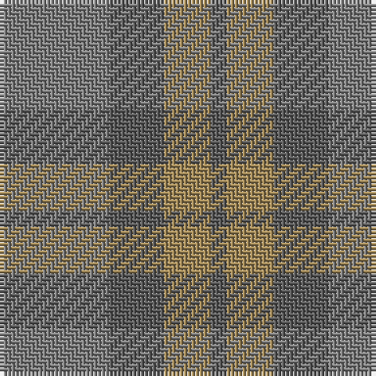

The parent of this is [Outlander #3](/tartans/n/28/na14/lt12/na/4/)

This was sourced from register-of-tartans.  It is a [4 stripes tartan](/stripes/stripes4/).

Original link https://www.tartanregister.gov.uk/tartanDetails.aspx?ref=11115

## Thread count
N/28 Na14 LT12 Na/4

## Palette
Each colour and its ΔE from the base-6 reference it is a variant of.

| Colour | Shade | Base | ΔE (OKLab) |
|---|---|---|---|
| LT |  `#A08858` | Y  | 0.21 |
| N |  `#808080` | G  | 0.22 |
| Na |  `#5C5C5C` | B  | 0.14 |

# Sample pattern

ID: /variants/n/28/na14/lt12/na/4-lta08858-n808080-na5c5c5c/
