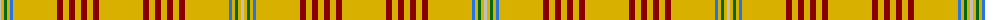

The parent of this is [Catalan (92 Olympics) (District)](/tartans/n/3/y3/g3/y3/b3/y44/dr6/y6/dr6/y6/dr6/y6/dr6/y/44/)

This was sourced from tartans-authority.  It is a [14 stripes tartan](/stripes/stripes14/).

Original link http://www.tartansauthority.com/tartan-ferret/display/2071/

## Thread count
N/3 Y3 G3 Y3 B3 Y44 DR6 Y6 DR6 Y6 DR6 Y6 DR6 Y/44

## Palette
Each colour and its ΔE from the base-6 reference it is a variant of.

| Colour | Shade | Base | ΔE (OKLab) |
|---|---|---|---|
| B |  `#2474E8` | B  | 0.20 |
| DR |  `#880000` | R  | 0.14 |
| G |  `#006818` | G  | 0.02 |
| N |  `#C0C0C0` | W  | 0.16 |
| Y |  `#D8B000` | Y  | 0.05 |

ID: /variants/n/3/y3/g3/y3/b3/y44/dr6/y6/dr6/y6/dr6/y6/dr6/y/44-b2474e8-dr880000-g006818-nc0c0c0-yd8b000/
