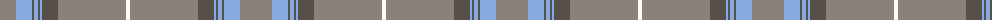

The parent of this is [Stuart of Bute St Colmac](/tartans/n/32/lp16/na2/lp4/na2/lp2/na16/n68/w/4/)

This was sourced from register-of-tartans.  It is a [9 stripes tartan](/stripes/stripes9/).

Original link https://www.tartanregister.gov.uk/tartanDetails.aspx?ref=10777

## Thread count
N/32 LP16 Na2 LP4 Na2 LP2 Na16 N68 W/4

## Palette
Each colour and its ΔE from the base-6 reference it is a variant of.

| Colour | Shade | Base | ΔE (OKLab) |
|---|---|---|---|
| LP |  `#88ACE0` | W  | 0.25 |
| N |  `#8C8179` | R  | 0.22 |
| Na |  `#565148` | B  | 0.14 |
| W |  `#FDFBF8` | W  | 0.02 |

ID: /variants/n/32/lp16/na2/lp4/na2/lp2/na16/n68/w/4-lp88ace0-n8c8179-na565148-wfdfbf8/
