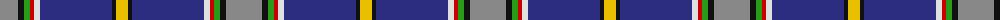

The parent of this is [M'Kleod Personal Tartan Tartan Number: 5985. Earliest known date: 2003 The unusual spelling raised a query with the recording authority. The recording was passed on the basis that the design was categorised as personal. See products available Copyright © Blair Urquhart, Comrie, 2015](/tartans/n/36/k6/g6/r4/ln6/db72/k4/y/12/)

This was sourced from house-of-tartan.  It is a [8 stripes tartan](/stripes/stripes8/).

Original link http://www.house-of-tartan.scotland.net/house/TartanViewjs.asp?colr=Def&tnam=5985

## Thread count
N/36 K6 G6 R4 LN6 DB72 K4 Y/12

## Palette
Each colour and its ΔE from the base-6 reference it is a variant of.

| Colour | Shade | Base | ΔE (OKLab) |
|---|---|---|---|
| DB |  `#2C2C80` | B  | 0.05 |
| G |  `#289C18` | G  | 0.18 |
| K |  `#101010` | K  | 0.17 |
| LN |  `#E0E0E0` | W  | 0.06 |
| N |  `#888888` | R  | 0.24 |
| R |  `#C80000` | R  | 0.00 |
| Y |  `#E8C000` | Y  | 0.00 |

# Sample pattern

ID: /variants/n/36/k6/g6/r4/ln6/db72/k4/y/12-db2c2c80-g289c18-k101010-lne0e0e0-n888888-rc80000-ye8c000/
