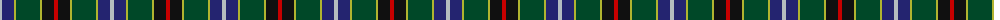
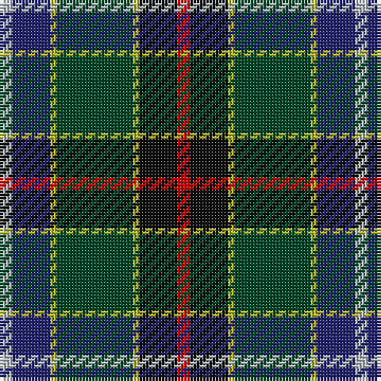

The parent of this is [James (Personal)](/tartans/n/4/db12/y2/dg24/y2/k12/r/4/)

This was sourced from tartans-authority.  It is a [7 stripes tartan](/stripes/stripes7/).

Original link http://www.tartansauthority.com/tartan-ferret/display/2456/

## Thread count
N/4 DB12 Y2 DG24 Y2 K12 R/4

## Palette
Each colour and its ΔE from the base-6 reference it is a variant of.

| Colour | Shade | Base | ΔE (OKLab) |
|---|---|---|---|
| DB |  `#242470` | B  | 0.08 |
| DG |  `#004828` | G  | 0.11 |
| K |  `#101010` | K  | 0.17 |
| N |  `#B4BCC0` | W  | 0.18 |
| R |  `#C80000` | R  | 0.00 |
| Y |  `#B0B430` | Y  | 0.09 |

# Sample pattern

ID: /variants/n/4/db12/y2/dg24/y2/k12/r/4-db242470-dg004828-k101010-nb4bcc0-rc80000-yb0b430/
