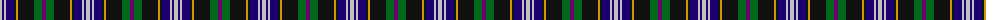

The parent of this is [Scottish Cultural Society (Corporate](/tartans/n/4/db2/n2/db8/k2/dy2/k16/g8/p/4/)

This was sourced from tartans-authority.  It is a [9 stripes tartan](/stripes/stripes9/).

Original link http://www.tartansauthority.com/tartan-ferret/display/2390/

## Thread count
N/4 DB2 N2 DB8 K2 DY2 K16 G8 P/4

## Palette
Each colour and its ΔE from the base-6 reference it is a variant of.

| Colour | Shade | Base | ΔE (OKLab) |
|---|---|---|---|
| DB |  `#1C0070` | B  | 0.14 |
| DY |  `#D09800` | Y  | 0.11 |
| G |  `#006818` | G  | 0.02 |
| K |  `#101010` | K  | 0.17 |
| N |  `#C0C0C0` | W  | 0.16 |
| P |  `#6C0070` | B  | 0.15 |

ID: /variants/n/4/db2/n2/db8/k2/dy2/k16/g8/p/4-db1c0070-dyd09800-g006818-k101010-nc0c0c0-p6c0070/
