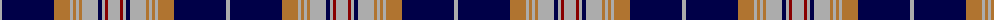

The parent of this is [Carsaig (Fashion)](/tartans/n/4/db52/lt16/n3/lt3/n3/lt3/n16/db4/n3/dr3/n/12/)

This was sourced from tartans-authority.  It is a [12 stripes tartan](/stripes/stripes12/).

Original link http://www.tartansauthority.com/tartan-ferret/display/4472/

## Thread count
N/4 DB52 LT16 N3 LT3 N3 LT3 N16 DB4 N3 DR3 N/12

## Palette
Each colour and its ΔE from the base-6 reference it is a variant of.

| Colour | Shade | Base | ΔE (OKLab) |
|---|---|---|---|
| DB |  `#000048` | B  | 0.21 |
| DR |  `#880000` | R  | 0.14 |
| LT |  `#B07430` | R  | 0.17 |
| N |  `#ACACAC` | Y  | 0.18 |

ID: /variants/n/4/db52/lt16/n3/lt3/n3/lt3/n16/db4/n3/dr3/n/12-db000048-dr880000-ltb07430-nacacac/
