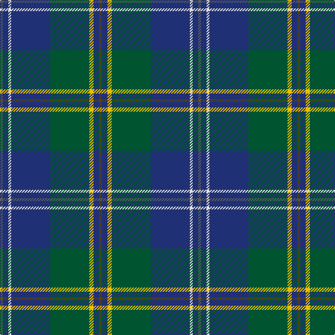

The parent of this is [Laurentian University (Corporate)](/tartans/n/4/db8/ln4/db56/g56/y6/db8/t/4/)

This was sourced from tartans-authority.  It is a [8 stripes tartan](/stripes/stripes8/).

Original link http://www.tartansauthority.com/tartan-ferret/display/7324/

## Thread count
N/4 DB8 LN4 DB56 G56 Y6 DB8 T/4

## Palette
Each colour and its ΔE from the base-6 reference it is a variant of.

| Colour | Shade | Base | ΔE (OKLab) |
|---|---|---|---|
| DB |  `#203074` | B  | 0.05 |
| G |  `#005430` | G  | 0.08 |
| LN |  `#E0E0E0` | W  | 0.06 |
| N |  `#5C5C5C` | B  | 0.14 |
| T |  `#604000` | G  | 0.14 |
| Y |  `#E8C000` | Y  | 0.00 |

# Sample pattern

ID: /variants/n/4/db8/ln4/db56/g56/y6/db8/t/4-db203074-g005430-lne0e0e0-n5c5c5c-t604000-ye8c000/
