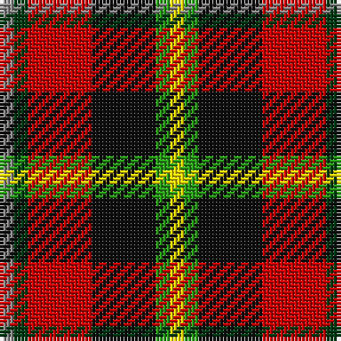

The parent of this is [Wolves Wod Kindred](/tartans/n/4/dg4/r18/k18/g4/y/4/)

This was sourced from register-of-tartans.  It is a [6 stripes tartan](/stripes/stripes6/).

Original link https://www.tartanregister.gov.uk/tartanDetails.aspx?ref=11592

## Thread count
N/4 DG4 R18 K18 G4 Y/4

## Palette
Each colour and its ΔE from the base-6 reference it is a variant of.

| Colour | Shade | Base | ΔE (OKLab) |
|---|---|---|---|
| DG |  `#003C14` | G  | 0.14 |
| G |  `#289C18` | G  | 0.18 |
| K |  `#101010` | K  | 0.17 |
| N |  `#888888` | R  | 0.24 |
| R |  `#C80000` | R  | 0.00 |
| Y |  `#FFE600` | Y  | 0.10 |

# Sample pattern

ID: /variants/n/4/dg4/r18/k18/g4/y/4-dg003c14-g289c18-k101010-n888888-rc80000-yffe600/
