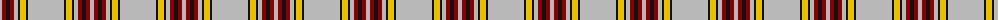

The parent of this is [Anthony Plaid Ecru](/tartans/n/4/dr4/k4/dr4/n4/k2/y6/k2/n/36/)

This was sourced from register-of-tartans.  It is a [9 stripes tartan](/stripes/stripes9/).

Original link https://www.tartanregister.gov.uk/tartanDetails.aspx?ref=5168

## Thread count
N/4 DR4 K4 DR4 N4 K2 Y6 K2 N/36

## Palette
Each colour and its ΔE from the base-6 reference it is a variant of.

| Colour | Shade | Base | ΔE (OKLab) |
|---|---|---|---|
| DR |  `#880000` | R  | 0.14 |
| K |  `#101010` | K  | 0.17 |
| N |  `#B8B8B8` | Y  | 0.17 |
| Y |  `#E8C000` | Y  | 0.00 |

ID: /variants/n/4/dr4/k4/dr4/n4/k2/y6/k2/n/36-dr880000-k101010-nb8b8b8-ye8c000/
