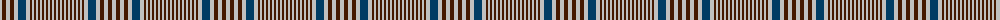

The parent of this is [Prince of Wales Check](/tartans/n/4/dr4/n4/dr4/n4/db8/n4/dr2/n2/dr2/n2/dr2/n2/dr2/n2/dr2/n2/dr2/n2/dr2/n/2/)

This was sourced from register-of-tartans.  It is a [21 stripes tartan](/stripes/stripes21/).

Original link https://www.tartanregister.gov.uk/tartanDetails.aspx?ref=5038

## Thread count
N/4 DR4 N4 DR4 N4 DB8 N4 DR2 N2 DR2 N2 DR2 N2 DR2 N2 DR2 N2 DR2 N2 DR2 N/2

## Palette
Each colour and its ΔE from the base-6 reference it is a variant of.

| Colour | Shade | Base | ΔE (OKLab) |
|---|---|---|---|
| DB |  `#003C64` | B  | 0.07 |
| DR |  `#441800` | B  | 0.22 |
| N |  `#C0C0C0` | W  | 0.16 |

ID: /variants/n/4/dr4/n4/dr4/n4/db8/n4/dr2/n2/dr2/n2/dr2/n2/dr2/n2/dr2/n2/dr2/n2/dr2/n/2-db003c64-dr441800-nc0c0c0/
