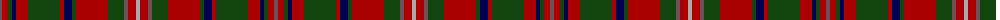

The parent of this is [MacKinnon](/tartans/n/4/dr6/dg4/db4/dr12/dg32/dr4/db8/dg4/dr32/dg16/n4/dr8/na/4/)

This was sourced from weddslist.  It is a [14 stripes tartan](/stripes/stripes14/).

Original link http://www.weddslist.com/cgi-bin/tartans/pg.pl?source=tinsel

## Thread count
N/4 DR6 DG4 DB4 DR12 DG32 DR4 DB8 DG4 DR32 DG16 N4 DR8 Na/4

## Palette
Each colour and its ΔE from the base-6 reference it is a variant of.

| Colour | Shade | Base | ΔE (OKLab) |
|---|---|---|---|
| DB |  `#000052` | B  | 0.20 |
| DG |  `#11450D` | G  | 0.10 |
| DR |  `#AA0000` | R  | 0.06 |
| N |  `#6E5058` | B  | 0.14 |
| Na |  `#AAAAAA` | Y  | 0.19 |

ID: /variants/n/4/dr6/dg4/db4/dr12/dg32/dr4/db8/dg4/dr32/dg16/n4/dr8/na/4-db000052-dg11450d-draa0000-n6e5058-naaaaaaa/
