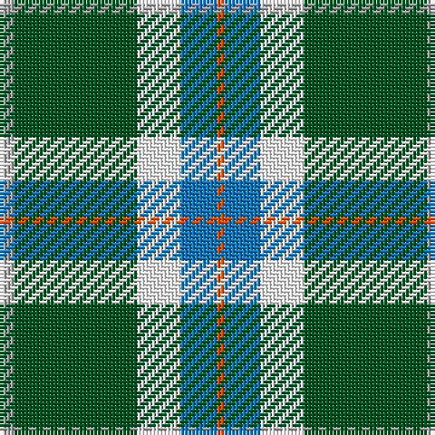

The parent of this is [Scotstown](/tartans/n/4/g34/w12/b10/r/2/)

This was sourced from register-of-tartans.  It is a [5 stripes tartan](/stripes/stripes5/).

Original link https://www.tartanregister.gov.uk/tartanDetails.aspx?ref=11595

## Thread count
N/4 G34 W12 B10 R/2

## Palette
Each colour and its ΔE from the base-6 reference it is a variant of.

| Colour | Shade | Base | ΔE (OKLab) |
|---|---|---|---|
| B |  `#1474B4` | B  | 0.15 |
| G |  `#005020` | G  | 0.08 |
| N |  `#A0A0A0` | Y  | 0.20 |
| R |  `#FA4B00` | R  | 0.14 |
| W |  `#FFFFFF` | W  | 0.03 |

# Sample pattern

ID: /variants/n/4/g34/w12/b10/r/2-b1474b4-g005020-na0a0a0-rfa4b00-wffffff/
