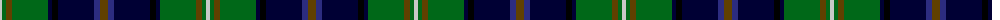

The parent of this is [Tombow 21st School Memorial](/tartans/n/4/g4/t6/g36/db4/k6/db36/dba6/t/8/)

This was sourced from register-of-tartans.  It is a [9 stripes tartan](/stripes/stripes9/).

Original link https://www.tartanregister.gov.uk/tartanDetails.aspx?ref=4136

## Thread count
N/4 G4 T6 G36 DB4 K6 DB36 DBa6 T/8

## Palette
Each colour and its ΔE from the base-6 reference it is a variant of.

| Colour | Shade | Base | ΔE (OKLab) |
|---|---|---|---|
| DB |  `#000034` | K  | 0.18 |
| DBa |  `#2C2C80` | B  | 0.05 |
| G |  `#006818` | G  | 0.02 |
| K |  `#000000` | K  | 0.00 |
| N |  `#C8C8C8` | W  | 0.13 |
| T |  `#604000` | G  | 0.14 |

ID: /variants/n/4/g4/t6/g36/db4/k6/db36/dba6/t/8-db000034-dba2c2c80-g006818-k000000-nc8c8c8-t604000/
