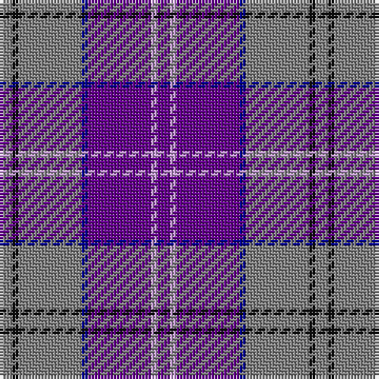

The parent of this is [Lennox Primary School](/tartans/n/4/k2/n20/db2/p20/lp2/p/4/)

This was sourced from register-of-tartans.  It is a [7 stripes tartan](/stripes/stripes7/).

Original link https://www.tartanregister.gov.uk/tartanDetails.aspx?ref=11442

## Thread count
N/4 K2 N20 DB2 P20 LP2 P/4

## Palette
Each colour and its ΔE from the base-6 reference it is a variant of.

| Colour | Shade | Base | ΔE (OKLab) |
|---|---|---|---|
| DB |  `#00008C` | B  | 0.13 |
| K |  `#101010` | K  | 0.17 |
| LP |  `#C49CD8` | W  | 0.24 |
| N |  `#808080` | G  | 0.22 |
| P |  `#64008C` | B  | 0.13 |

# Sample pattern

ID: /variants/n/4/k2/n20/db2/p20/lp2/p/4-db00008c-k101010-lpc49cd8-n808080-p64008c/
