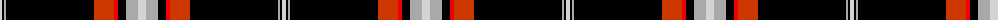

The parent of this is [Calgary HOG](/tartans/n/4/k2/na2/k88/do20/r4/k8/na12/n/8/)

This was sourced from register-of-tartans.  It is a [9 stripes tartan](/stripes/stripes9/).

Original link https://www.tartanregister.gov.uk/tartanDetails.aspx?ref=10396

## Thread count
N/4 K2 Na2 K88 DO20 R4 K8 Na12 N/8

## Palette
Each colour and its ΔE from the base-6 reference it is a variant of.

| Colour | Shade | Base | ΔE (OKLab) |
|---|---|---|---|
| DO |  `#CD3700` | R  | 0.05 |
| K |  `#000000` | K  | 0.00 |
| N |  `#D3D3D3` | W  | 0.10 |
| Na |  `#A9A9A9` | Y  | 0.19 |
| R |  `#EE0000` | R  | 0.08 |

ID: /variants/n/4/k2/na2/k88/do20/r4/k8/na12/n/8-docd3700-k000000-nd3d3d3-naa9a9a9-ree0000/
