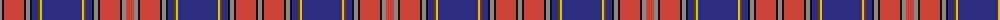

The parent of this is [Blais Family Tartan Tartan Number: 2321. Earliest known date: 1997 For Francine Paquet Blais's Canadian family with a direct line of descent from 1669. (STS) See products available Copyright © Blair Urquhart, Comrie, 2015](/tartans/n/4/k2/r20/k2/n4/k2/db6/t2/y2/db40/y2/t2/db6/k2/n4/k2/r20/k2/n4/r/8/)

This was sourced from house-of-tartan.  It is a [20 stripes tartan](/stripes/stripes20/).

Original link http://www.house-of-tartan.scotland.net/house/TartanViewjs.asp?colr=Def&tnam=2321

## Thread count
N/4 K2 R20 K2 N4 K2 DB6 T2 Y2 DB40 Y2 T2 DB6 K2 N4 K2 R20 K2 N4 R/8

## Palette
Each colour and its ΔE from the base-6 reference it is a variant of.

| Colour | Shade | Base | ΔE (OKLab) |
|---|---|---|---|
| DB |  `#2C2C80` | B  | 0.05 |
| K |  `#101010` | K  | 0.17 |
| N |  `#888888` | R  | 0.24 |
| Na |  `#787878` | G  | 0.20 |
| R |  `#CC4438` | R  | 0.07 |
| T |  `#604000` | G  | 0.14 |
| Y |  `#E8C000` | Y  | 0.00 |

ID: /variants/n/4/k2/r20/k2/n4/k2/db6/t2/y2/db40/y2/t2/db6/k2/n4/k2/r20/k2/n4/r/8-db2c2c80-k101010-n888888-na787878-rcc4438-t604000-ye8c000/
