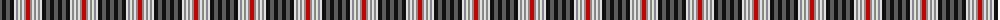

The parent of this is [Unidentified (2103)](/tartans/n/4/k4/n4/k4/ln2/na2/ln2/na2/ln2/na2/r/4/)

This was sourced from tartans-authority.  It is a [11 stripes tartan](/stripes/stripes11/).

Original link http://www.tartansauthority.com/tartan-ferret/display/8288/

## Thread count
N/4 K4 N4 K4 LN2 Na2 LN2 Na2 LN2 Na2 R/4

## Palette
Each colour and its ΔE from the base-6 reference it is a variant of.

| Colour | Shade | Base | ΔE (OKLab) |
|---|---|---|---|
| K |  `#101010` | K  | 0.17 |
| LN |  `#E0E0E0` | W  | 0.06 |
| N |  `#5C5C5C` | B  | 0.14 |
| Na |  `#888888` | R  | 0.24 |
| R |  `#C80000` | R  | 0.00 |

ID: /variants/n/4/k4/n4/k4/ln2/na2/ln2/na2/ln2/na2/r/4-k101010-lne0e0e0-n5c5c5c-na888888-rc80000/
