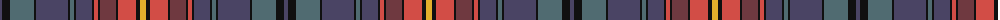

The parent of this is [Golden Glow](/tartans/n/4/k8/na24/k2/n32/k2/na4/k2/n16/k2/r4/k2/dr16/k2/r18/k4/y/6/)

This was sourced from register-of-tartans.  It is a [17 stripes tartan](/stripes/stripes17/).

Original link https://www.tartanregister.gov.uk/tartanDetails.aspx?ref=10291

## Thread count
N/4 K8 Na24 K2 N32 K2 Na4 K2 N16 K2 R4 K2 DR16 K2 R18 K4 Y/6

## Palette
Each colour and its ΔE from the base-6 reference it is a variant of.

| Colour | Shade | Base | ΔE (OKLab) |
|---|---|---|---|
| DR |  `#6F3940` | B  | 0.16 |
| K |  `#101010` | K  | 0.17 |
| N |  `#4A4464` | B  | 0.07 |
| Na |  `#506B71` | B  | 0.15 |
| R |  `#D24D46` | R  | 0.09 |
| Y |  `#E2AF2C` | Y  | 0.05 |

ID: /variants/n/4/k8/na24/k2/n32/k2/na4/k2/n16/k2/r4/k2/dr16/k2/r18/k4/y/6-dr6f3940-k101010-n4a4464-na506b71-rd24d46-ye2af2c/
