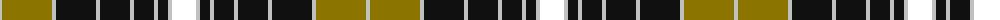

The parent of this is [Liberty Square](/tartans/n/4/lg50/n4/k40/n4/k30/n4/k20/n4/k10/n4/w/24/)

This was sourced from register-of-tartans.  It is a [12 stripes tartan](/stripes/stripes12/).

Original link https://www.tartanregister.gov.uk/tartanDetails.aspx?ref=10621

## Thread count
N/4 LG50 N4 K40 N4 K30 N4 K20 N4 K10 N4 W/24

## Palette
Each colour and its ΔE from the base-6 reference it is a variant of.

| Colour | Shade | Base | ΔE (OKLab) |
|---|---|---|---|
| K |  `#101010` | K  | 0.17 |
| LG |  `#8B7500` | G  | 0.17 |
| N |  `#C0C0C0` | W  | 0.16 |
| W |  `#FFFFFF` | W  | 0.03 |

ID: /variants/n/4/lg50/n4/k40/n4/k30/n4/k20/n4/k10/n4/w/24-k101010-lg8b7500-nc0c0c0-wffffff/
