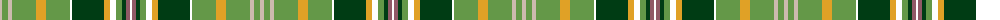

The parent of this is [Malone, Keagan Allen (Personal)](/tartans/n/4/lg6/n4/lg24/y10/lg24/w2/dg32/y6/w6/lg6/dg4/lt4/w/2/)

This was sourced from register-of-tartans.  It is a [14 stripes tartan](/stripes/stripes14/).

Original link https://www.tartanregister.gov.uk/tartanDetails.aspx?ref=11625

## Thread count
N/4 LG6 N4 LG24 Y10 LG24 W2 DG32 Y6 W6 LG6 DG4 LT4 W/2

## Palette
Each colour and its ΔE from the base-6 reference it is a variant of.

| Colour | Shade | Base | ΔE (OKLab) |
|---|---|---|---|
| DG |  `#003C14` | G  | 0.14 |
| LG |  `#649848` | G  | 0.19 |
| LT |  `#905966` | R  | 0.15 |
| N |  `#CCBAAF` | Y  | 0.15 |
| W |  `#FFFFFF` | W  | 0.03 |
| Y |  `#E0A126` | Y  | 0.08 |

ID: /variants/n/4/lg6/n4/lg24/y10/lg24/w2/dg32/y6/w6/lg6/dg4/lt4/w/2-dg003c14-lg649848-lt905966-nccbaaf-wffffff-ye0a126/
