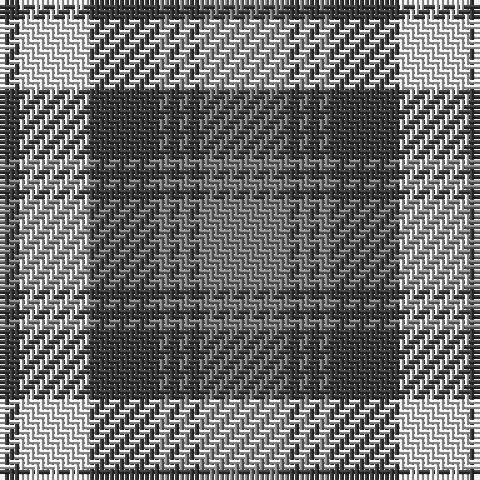

The parent of this is [Grey Watch, Dress](/tartans/n/4/ln14/n14/na2/n2/na2/n2/na/18/)

This was sourced from register-of-tartans.  It is a [8 stripes tartan](/stripes/stripes8/).

Original link https://www.tartanregister.gov.uk/tartanDetails.aspx?ref=1544

## Thread count
N/4 LN14 N14 Na2 N2 Na2 N2 Na/18

## Palette
Each colour and its ΔE from the base-6 reference it is a variant of.

| Colour | Shade | Base | ΔE (OKLab) |
|---|---|---|---|
| LN |  `#E0E0E0` | W  | 0.06 |
| N |  `#3C3C3C` | B  | 0.12 |
| Na |  `#808080` | G  | 0.22 |

# Sample pattern

ID: /variants/n/4/ln14/n14/na2/n2/na2/n2/na/18-lne0e0e0-n3c3c3c-na808080/
