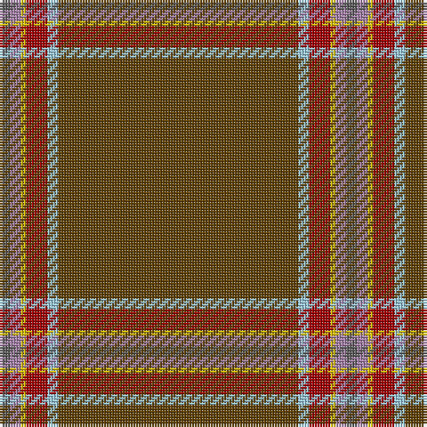

The parent of this is [Windy Meadows (Fashion)](/tartans/n/4/lp4/y2/dr8/lb4/t/90/)

This was sourced from tartans-authority.  It is a [6 stripes tartan](/stripes/stripes6/).

Original link http://www.tartansauthority.com/tartan-ferret/display/10299/

## Thread count
N/4 LP4 Y2 DR8 LB4 T/90

## Palette
Each colour and its ΔE from the base-6 reference it is a variant of.

| Colour | Shade | Base | ΔE (OKLab) |
|---|---|---|---|
| DR |  `#A00000` | R  | 0.09 |
| LB |  `#98C8E8` | W  | 0.17 |
| LP |  `#A480A8` | R  | 0.23 |
| N |  `#5C5C5C` | B  | 0.14 |
| T |  `#604000` | G  | 0.14 |
| Y |  `#E8C000` | Y  | 0.00 |

# Sample pattern

ID: /variants/n/4/lp4/y2/dr8/lb4/t/90-dra00000-lb98c8e8-lpa480a8-n5c5c5c-t604000-ye8c000/
