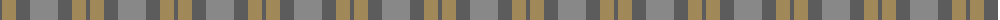
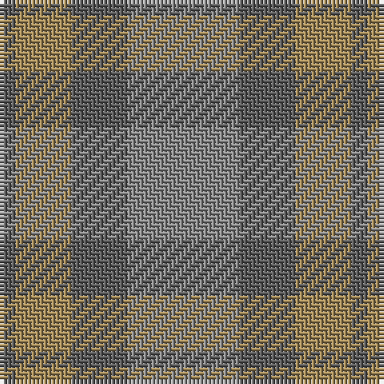

The parent of this is [Outlander #3](/tartans/n/4/lt14/n14/na/28/)

This was sourced from tartans-authority.  It is a [4 stripes tartan](/stripes/stripes4/).

Original link http://www.tartansauthority.com/tartan-ferret/display/11115/

## Thread count
N/4 LT14 N14 Na/28

## Palette
Each colour and its ΔE from the base-6 reference it is a variant of.

| Colour | Shade | Base | ΔE (OKLab) |
|---|---|---|---|
| LT |  `#A08858` | Y  | 0.21 |
| N |  `#5C5C5C` | B  | 0.14 |
| Na |  `#888888` | R  | 0.24 |

# Sample pattern

ID: /variants/n/4/lt14/n14/na/28-lta08858-n5c5c5c-na888888/
