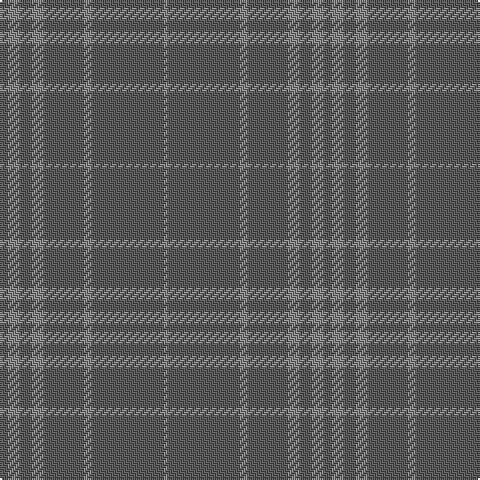

The parent of this is [Hebridean Mist (Fashion)](/tartans/n/4/na6/n6/na6/n20/na4/n36/na/2/)

This was sourced from tartans-authority.  It is a [8 stripes tartan](/stripes/stripes8/).

Original link http://www.tartansauthority.com/tartan-ferret/display/6823/

## Thread count
N/4 Na6 N6 Na6 N20 Na4 N36 Na/2

## Palette
Each colour and its ΔE from the base-6 reference it is a variant of.

| Colour | Shade | Base | ΔE (OKLab) |
|---|---|---|---|
| N |  `#5C5C5C` | B  | 0.14 |
| Na |  `#888888` | R  | 0.24 |

# Sample pattern

ID: /variants/n/4/na6/n6/na6/n20/na4/n36/na/2-n5c5c5c-na888888/
