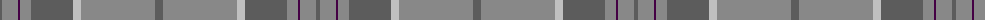
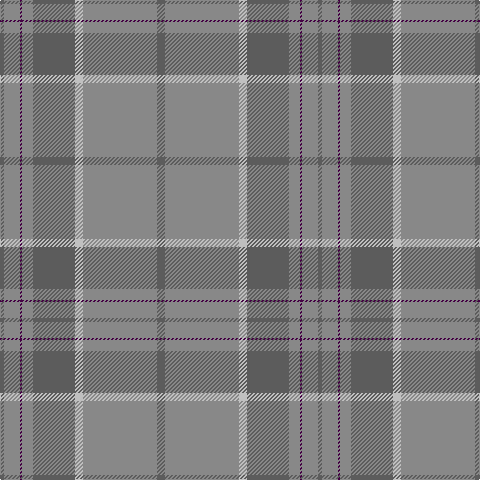

The parent of this is [Orkney Slate (Fashion)](/tartans/n/4/nb16/dp2/nb11/n42/na8/nb74/n/8/)

This was sourced from tartans-authority.  It is a [8 stripes tartan](/stripes/stripes8/).

Original link http://www.tartansauthority.com/tartan-ferret/display/10440/

## Thread count
N/4 Nb16 DP2 Nb11 N42 Na8 Nb74 N/8

## Palette
Each colour and its ΔE from the base-6 reference it is a variant of.

| Colour | Shade | Base | ΔE (OKLab) |
|---|---|---|---|
| DP |  `#440044` | B  | 0.17 |
| N |  `#5C5C5C` | B  | 0.14 |
| Na |  `#C0C0C0` | W  | 0.16 |
| Nb |  `#888888` | R  | 0.24 |

# Sample pattern

ID: /variants/n/4/nb16/dp2/nb11/n42/na8/nb74/n/8-dp440044-n5c5c5c-nac0c0c0-nb888888/
