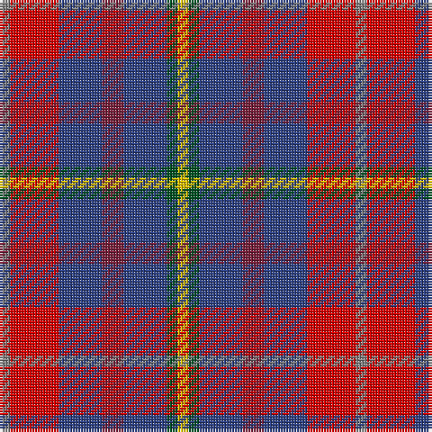

The parent of this is [Feis An Eilein](/tartans/n/4/r18/b16/dr8/b16/g4/y/4/)

This was sourced from register-of-tartans.  It is a [7 stripes tartan](/stripes/stripes7/).

Original link https://www.tartanregister.gov.uk/tartanDetails.aspx?ref=5889

## Thread count
N/4 R18 B16 DR8 B16 G4 Y/4

## Palette
Each colour and its ΔE from the base-6 reference it is a variant of.

| Colour | Shade | Base | ΔE (OKLab) |
|---|---|---|---|
| B |  `#2C4084` | B  | 0.00 |
| DR |  `#781C38` | R  | 0.17 |
| G |  `#005020` | G  | 0.08 |
| N |  `#808080` | G  | 0.22 |
| R |  `#DC0000` | R  | 0.04 |
| Y |  `#E8C000` | Y  | 0.00 |

# Sample pattern

ID: /variants/n/4/r18/b16/dr8/b16/g4/y/4-b2c4084-dr781c38-g005020-n808080-rdc0000-ye8c000/
