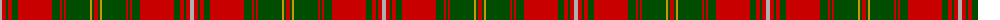

The parent of this is [Hayes (Fashion)](/tartans/n/4/r4/g2/r4/g6/r34/g8/r2/g2/r2/g24/dy2/g2/r/4/)

This was sourced from tartans-authority.  It is a [14 stripes tartan](/stripes/stripes14/).

Original link http://www.tartansauthority.com/tartan-ferret/display/5168/

## Thread count
N/4 R4 G2 R4 G6 R34 G8 R2 G2 R2 G24 DY2 G2 R/4

## Palette
Each colour and its ΔE from the base-6 reference it is a variant of.

| Colour | Shade | Base | ΔE (OKLab) |
|---|---|---|---|
| DY |  `#C89800` | Y  | 0.12 |
| G |  `#004C00` | G  | 0.08 |
| N |  `#B0B0B0` | Y  | 0.18 |
| R |  `#C80000` | R  | 0.00 |

ID: /variants/n/4/r4/g2/r4/g6/r34/g8/r2/g2/r2/g24/dy2/g2/r/4-dyc89800-g004c00-nb0b0b0-rc80000/
