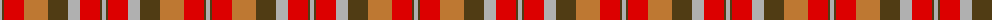

The parent of this is [Unidentified Sett](/tartans/n/4/t2/r20/do24/t20/n12/r20/t2/n/4/)

This was sourced from register-of-tartans.  It is a [9 stripes tartan](/stripes/stripes9/).

Original link https://www.tartanregister.gov.uk/tartanDetails.aspx?ref=4382

## Thread count
N/4 T2 R20 DO24 T20 N12 R20 T2 N/4

## Palette
Each colour and its ΔE from the base-6 reference it is a variant of.

| Colour | Shade | Base | ΔE (OKLab) |
|---|---|---|---|
| DO |  `#BE7832` | R  | 0.17 |
| N |  `#B0B0B0` | Y  | 0.18 |
| R |  `#DC0000` | R  | 0.04 |
| T |  `#503C14` | G  | 0.15 |

ID: /variants/n/4/t2/r20/do24/t20/n12/r20/t2/n/4-dobe7832-nb0b0b0-rdc0000-t503c14/
