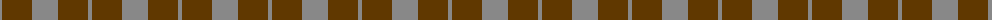
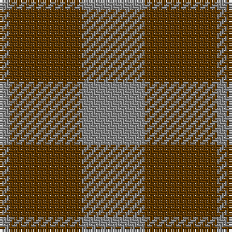

The parent of this is [Outlander #5](/tartans/n/4/t30/n/26/)

This was sourced from tartans-authority.  It is a [3 stripes tartan](/stripes/stripes3/).

Original link http://www.tartansauthority.com/tartan-ferret/display/11117/

## Thread count
N/4 T30 N/26

## Palette
Each colour and its ΔE from the base-6 reference it is a variant of.

| Colour | Shade | Base | ΔE (OKLab) |
|---|---|---|---|
| N |  `#888888` | R  | 0.24 |
| T |  `#603800` | G  | 0.16 |

# Sample pattern

ID: /variants/n/4/t30/n/26-n888888-t603800/
