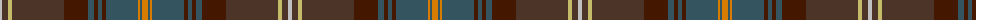

The parent of this is [Buglass](/tartans/n/4/t6/lg4/t52/dr24/na6/dr4/na4/dr4/na32/o2/na2/o/6/)

This was sourced from register-of-tartans.  It is a [13 stripes tartan](/stripes/stripes13/).

Original link https://www.tartanregister.gov.uk/tartanDetails.aspx?ref=435

## Thread count
N/4 T6 LG4 T52 DR24 Na6 DR4 Na4 DR4 Na32 O2 Na2 O/6

## Palette
Each colour and its ΔE from the base-6 reference it is a variant of.

| Colour | Shade | Base | ΔE (OKLab) |
|---|---|---|---|
| DR |  `#441800` | B  | 0.22 |
| LG |  `#C4BC68` | Y  | 0.07 |
| N |  `#C0C0C0` | W  | 0.16 |
| Na |  `#345460` | B  | 0.10 |
| O |  `#D87C00` | Y  | 0.17 |
| T |  `#4C3428` | B  | 0.16 |

ID: /variants/n/4/t6/lg4/t52/dr24/na6/dr4/na4/dr4/na32/o2/na2/o/6-dr441800-lgc4bc68-nc0c0c0-na345460-od87c00-t4c3428/
