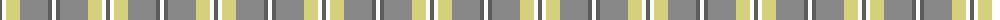

The parent of this is [Cairngorm (1963) (District)](/tartans/n/4/w4/lg14/na28/n4/w/4/)

This was sourced from tartans-authority.  It is a [6 stripes tartan](/stripes/stripes6/).

Original link http://www.tartansauthority.com/tartan-ferret/display/1314/

## Thread count
N/4 W4 LG14 Na28 N4 W/4

## Palette
Each colour and its ΔE from the base-6 reference it is a variant of.

| Colour | Shade | Base | ΔE (OKLab) |
|---|---|---|---|
| LG |  `#D4D07C` | Y  | 0.07 |
| N |  `#5C5C5C` | B  | 0.14 |
| Na |  `#888888` | R  | 0.24 |
| W |  `#FCFCFC` | W  | 0.03 |

# Sample pattern

ID: /variants/n/4/w4/lg14/na28/n4/w/4-lgd4d07c-n5c5c5c-na888888-wfcfcfc/
