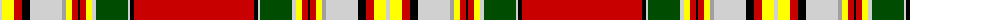

The parent of this is [Clan Chattan D](/tartans/n/4/y12/r8/k8/n32/na4/y6/r6/k2/r6/y6/n4/g32/n2/k4/r/120/)

This was sourced from weddslist.  It is a [16 stripes tartan](/stripes/stripes16/).

Original link http://www.weddslist.com/cgi-bin/tartans/pg.pl?source=rb

## Thread count
N/4 Y12 R8 K8 N32 Na4 Y6 R6 K2 R6 Y6 N4 G32 N2 K4 R/120

## Palette
Each colour and its ΔE from the base-6 reference it is a variant of.

| Colour | Shade | Base | ΔE (OKLab) |
|---|---|---|---|
| G |  `#004C00` | G  | 0.08 |
| K |  `#000000` | K  | 0.00 |
| N |  `#D0D0D0` | W  | 0.11 |
| Na |  `#A0A0A0` | Y  | 0.20 |
| R |  `#C80000` | R  | 0.00 |
| Y |  `#FFFF00` | Y  | 0.16 |

ID: /variants/n/4/y12/r8/k8/n32/na4/y6/r6/k2/r6/y6/n4/g32/n2/k4/r/120-g004c00-k000000-nd0d0d0-naa0a0a0-rc80000-yffff00/
