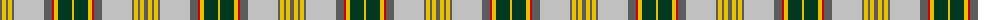

The parent of this is [Hutt #1 (Personal)](/tartans/n/4/y4/n2/y4/n2/na30/n8/r2/y4/dg14/y/2/)

This was sourced from tartans-authority.  It is a [11 stripes tartan](/stripes/stripes11/).

Original link http://www.tartansauthority.com/tartan-ferret/display/2568/

## Thread count
N/4 Y4 N2 Y4 N2 Na30 N8 R2 Y4 DG14 Y/2

## Palette
Each colour and its ΔE from the base-6 reference it is a variant of.

| Colour | Shade | Base | ΔE (OKLab) |
|---|---|---|---|
| DG |  `#003820` | G  | 0.16 |
| N |  `#5C5C5C` | B  | 0.14 |
| Na |  `#C0C0C0` | W  | 0.16 |
| R |  `#C80000` | R  | 0.00 |
| Y |  `#E8C000` | Y  | 0.00 |

ID: /variants/n/4/y4/n2/y4/n2/na30/n8/r2/y4/dg14/y/2-dg003820-n5c5c5c-nac0c0c0-rc80000-ye8c000/
