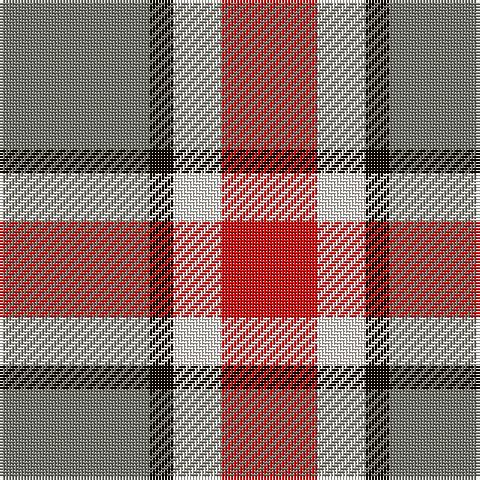

The parent of this is [Buckeye Corporate Tartan Tartan Number: 10702. Earliest known date: 20 September 2012 The official tartan for The Ohio State University. The Ohio State Buckeyes is a collegiate football team that competes as part of the National Collegiate Athletic Association (NCAA) Division I Football Bowl Subdivision, representing the Ohio State University in the Leaders Division of the Big Ten Conference. The tartan is a lattice work of the Ohio State football uniform strip pattern featuring the Ohio State University’s official school colours since 1878, scarlet and grey. See products available Copyright © Blair Urquhart, Comrie, 2015](/tartans/n/50/k8/w16/r/32/)

This was sourced from house-of-tartan.  It is a [4 stripes tartan](/stripes/stripes4/).

Original link http://www.house-of-tartan.scotland.net/house/TartanViewjs.asp?colr=Def&tnam=10702

## Thread count
N/50 K8 W16 R/32

## Palette
Each colour and its ΔE from the base-6 reference it is a variant of.

| Colour | Shade | Base | ΔE (OKLab) |
|---|---|---|---|
| K |  `#120A01` | K  | 0.15 |
| N |  `#75786C` | G  | 0.19 |
| R |  `#DD1212` | R  | 0.05 |
| W |  `#F7F1E8` | W  | 0.01 |

# Sample pattern

ID: /variants/n/50/k8/w16/r/32-k120a01-n75786c-rdd1212-wf7f1e8/
